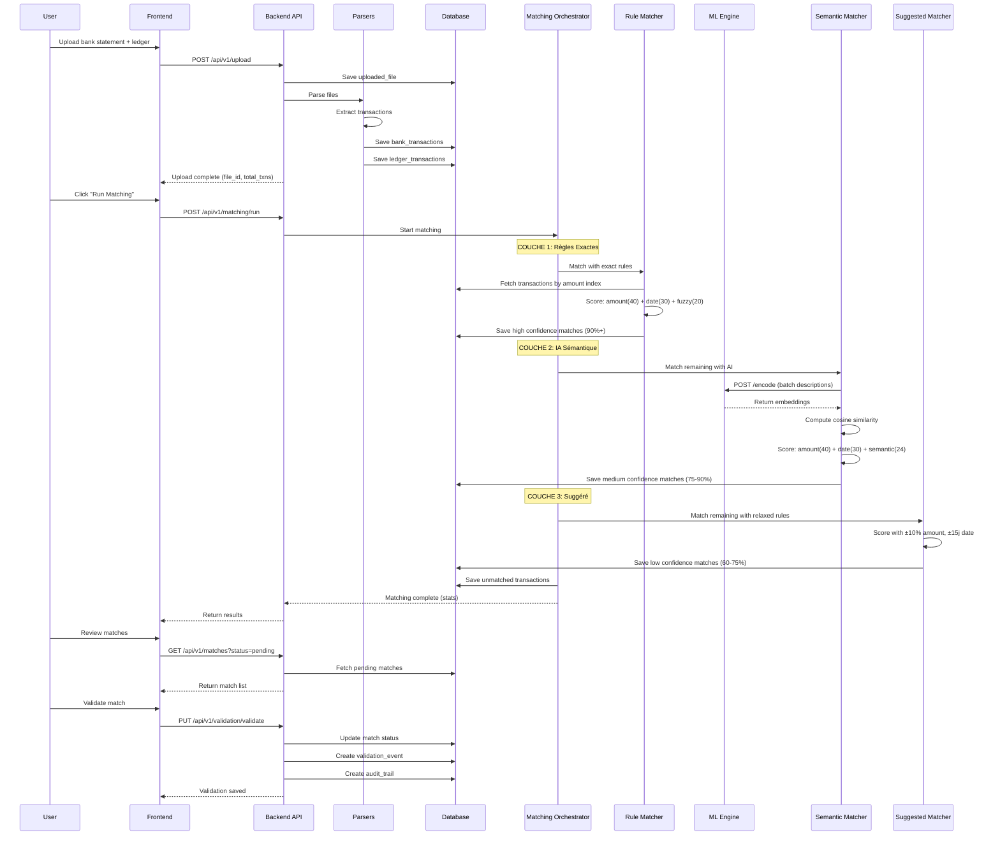

# ARCHITECTURE TECHNIQUE — MOTEUR DE RÉCONCILIATION BANCAIRE IA

**Système de réconciliation automatique pour institutions financières**  
Production-ready · Multi-banques · Multi-pays · Apprentissage supervisé

---

## 📋 Table des Matières

1. [Philosophie Architecturale](#philosophie-architecturale)
2. [Vue d'Ensemble du Système](#vue-densemble-du-système)
3. [Architecture Logicielle](#architecture-logicielle)
4. [Flux de Données](#flux-de-données)
5. [Algorithme de Matching](#algorithme-de-matching)
6. [Intelligence Artificielle](#intelligence-artificielle)
7. [Base de Données](#base-de-données)
8. [API REST](#api-rest)
9. [Sécurité et Conformité](#sécurité-et-conformité)
10. [Performance et Scalabilité](#performance-et-scalabilité)
11. [Déploiement](#déploiement)
12. [Décisions Architecturales](#décisions-architecturales)

---

## Philosophie Architecturale

### Principes Fondamentaux

Cette architecture repose sur **trois piliers non négociables** qui guident chaque décision technique :

#### 1. Auditabilité Totale

**Contexte :** Les institutions comme la Cour des Comptes du Sénégal doivent pouvoir justifier chaque réconciliation devant des auditeurs externes.

**Implémentation :**
- Chaque match stocke sa justification complète (montant, date, similarité sémantique)
- Audit trail enregistre qui, quand, quoi, pourquoi
- Versioning des décisions (si un match est corrigé, l'ancien est conservé avec lien)
- Export complet de l'historique pour audits

**Pourquoi c'est critique :** En cas de litige ou d'audit, prouver qu'une réconciliation est correcte n'est pas optionnel. C'est une obligation légale.

#### 2. Séparation Règles Métier / Intelligence Artificielle

**Contexte :** Les règles comptables (montant exact, date proche) sont déterministes et légalement définies. L'IA est probabiliste et nécessite supervision.

**Implémentation :**
- **Couche 1 (Règles)** : Matching exact basé sur critères stricts (montant, date, référence)
- **Couche 2 (IA)** : Matching sémantique via sentence-transformers (libellés similaires)
- **Couche 3 (Suggéré)** : Matching avec critères assouplis pour cas complexes
- Les trois couches sont **indépendantes** et peuvent être testées/validées séparément

**Pourquoi c'est critique :** Un expert-comptable doit pouvoir comprendre et valider les règles métier sans connaître les transformers. Un data scientist doit pouvoir améliorer l'IA sans risquer de casser la logique comptable.

#### 3. Vendor-Agnostic (Indépendance Fournisseurs)

**Contexte :** Le système doit fonctionner avec n'importe quelle banque, n'importe quel pays, n'importe quel format.

**Implémentation :**
- Parsers modulaires avec interface abstraite (ajout nouveau format = nouveau parser)
- Configuration par pays (devise, formats dates, séparateurs décimaux)
- Modèle ML multilingue (français, anglais, swahili, wolof)
- Export multi-formats (Excel, CSV, PDF, JSON)

**Pourquoi c'est critique :** PGS opère dans 16 pays africains. Un système qui ne marche qu'au Sénégal est inutile pour eux.

---

## Vue d'Ensemble du Système

### Architecture Haut Niveau
```
┌─────────────────────────────────────────────────────────────────┐
│                         UTILISATEUR                             │
│                    (Comptable / Validateur)                     │
└────────────────────────┬────────────────────────────────────────┘
                         │
                         ▼
┌─────────────────────────────────────────────────────────────────┐
│                      FRONTEND (React)                           │
│  • Upload fichiers (relevés bancaires, ledgers)                 │
│  • Visualisation matches (haute/moyenne/faible confiance)       │
│  • Validation manuelle (side-by-side view)                      │
│  • Dashboard métriques                                          │
│  • Export rapports                                              │
└────────────────────────┬────────────────────────────────────────┘
                         │ HTTPS/REST
                         ▼
┌─────────────────────────────────────────────────────────────────┐
│                    BACKEND API (FastAPI)                        │
│                                                                 │
│  ┌──────────────┐  ┌──────────────┐  ┌──────────────┐           │
│  │   Upload     │  │   Matching   │  │  Validation  │           │
│  │   Service    │  │ Orchestrator │  │   Service    │           │
│  └──────┬───────┘  └──────┬───────┘  └──────┬───────┘           │
│         │                  │                  │                 │
│         ▼                  ▼                  ▼                 │
│  ┌──────────────────────────────────────────────────┐           │
│  │            CORE BUSINESS LOGIC                   │           │
│  │  • Parsers (PDF, CSV, Excel)                     │           │
│  │  • Rule Matcher (couche 1 - exact)               │           │
│  │  • Semantic Matcher (couche 2 - IA)              │           │
│  │  • Suggested Matcher (couche 3 - assoupli)       │           │
│  │  • Duplicate Detector                            │           │
│  │  • Anomaly Detector                              │           │
│  │  • Learning Controller                           │           │
│  └──────────────────────┬───────────────────────────┘           │
│                         │                                       │
└─────────────────────────┼───────────────────────────────────────┘
                          │
        ┌─────────────────┼─────────────────┐
        │                 │                 │
        ▼                 ▼                 ▼
┌──────────────┐  ┌──────────────┐  ┌──────────────┐
│  PostgreSQL  │  │  ML Engine   │  │  Redis       │
│              │  │  (Isolated)  │  │  (Cache)     │
│ • Txns       │  │              │  │              │
│ • Matches    │  │ • Sentence   │  │ • Embeddings │
│ • Audit      │  │   Encoder    │  │ • Sessions   │
│ • Learning   │  │ • Semantic   │  │              │
│              │  │   Matcher    │  │              │
└──────────────┘  └──────────────┘  └──────────────┘
```

### Composants Principaux

| Composant | Rôle | Technologies | Localisation |
|-----------|------|--------------|--------------|
| **Frontend** | Interface utilisateur | React 18, Vite, Tailwind, Zustand | `frontend/` |
| **Backend API** | Orchestration, logique métier | FastAPI, SQLAlchemy, Pydantic | `backend/` |
| **Parsers** | Extraction documents | Camelot, pdfplumber, pandas | `parsers/` |
| **ML Engine** | Matching sémantique | sentence-transformers, PyTorch | `ml-engine/` |
| **Database** | Stockage données | PostgreSQL 15 | Managed service |
| **Cache** | Performance | Redis 7 | Managed service |

---

## Architecture Logicielle

### Pattern Architectural : Clean Architecture (Hexagonal)
```
┌─────────────────────────────────────────────────────────────────┐
│                        PRESENTATION LAYER                       │
│                         (frontend/)                             │
│  React components, pages, services, hooks, stores               │
└────────────────────────┬────────────────────────────────────────┘
                         │
                         ▼ HTTP/REST
┌─────────────────────────────────────────────────────────────────┐
│                      APPLICATION LAYER                          │
│                    (backend/app/api/v1/)                        │
│  API endpoints, request validation, response formatting         │
└────────────────────────┬────────────────────────────────────────┘
                         │
                         ▼
┌─────────────────────────────────────────────────────────────────┐
│                        DOMAIN LAYER                             │
│                    (backend/app/core/)                          │
│                                                                 │
│  ┌──────────────────────────────────────────────────┐           │
│  │  MATCHING ORCHESTRATOR (Coordinator)             │           │
│  │  • Reçoit transactions bancaires + ledger        │           │
│  │  • Route vers 3 couches matching                 │           │
│  │  • Agrège résultats                              │           │
│  │  • Applique business rules                       │           │
│  └──────────────────────┬───────────────────────────┘           │
│                         │                                       │
│         ┌───────────────┼───────────────┐                       │
│         ▼               ▼               ▼                       │
│  ┌──────────┐   ┌──────────┐   ┌──────────┐                     │
│  │  COUCHE  │   │  COUCHE  │   │  COUCHE  │                     │
│  │    1     │   │    2     │   │    3     │                     │
│  │  (Exact) │   │   (IA)   │   │(Suggéré) │                     │
│  │          │   │          │   │          │                     │
│  │ • Montant│   │ • ML     │   │ • Toléré │                     │
│  │   exact  │   │   Service│   │   10%    │                     │
│  │ • Date   │   │ • Semantic│  │ • Date   │                     │
│  │   ±2j    │   │   match  │   │   ±15j   │                     │
│  │ • Score  │   │ • Score  │   │ • Score  │                     │
│  │   90%+   │   │   75-90% │   │   60-75% │                     │
│  └──────────┘   └──────────┘   └──────────┘                     │
│                                                                 │
│  ┌──────────────────────────────────────────────────┐           │
│  │  BUSINESS SERVICES                               │           │
│  │  • Duplicate Detector                            │           │
│  │  • Anomaly Detector                              │           │
│  │  • Split Transaction Handler                     │           │
│  │  • Fee Detector                                  │           │
│  │  • Learning Controller                           │           │
│  │  • Audit Logger                                  │           │
│  └──────────────────────────────────────────────────┘           │
└────────────────────────┬────────────────────────────────────────┘
                         │
                         ▼
┌─────────────────────────────────────────────────────────────────┐
│                    INFRASTRUCTURE LAYER                         │
│                                                                 │
│  ┌──────────────┐  ┌──────────────┐  ┌──────────────┐           │
│  │  Data Access │  │  External    │  │  Technical   │           │
│  │              │  │  Services    │  │  Services    │           │
│  │ • ORM Models │  │ • ML Engine  │  │ • Logging    │           │
│  │ • Repos      │  │ • Parsers    │  │ • Monitoring │           │
│  │ • Migrations │  │ • Storage    │  │ • Caching    │           │
│  └──────────────┘  └──────────────┘  └──────────────┘           │
└─────────────────────────────────────────────────────────────────┘
```

### Avantages de cette Architecture

1. **Testabilité** : Chaque couche peut être testée indépendamment
2. **Maintenabilité** : Changements dans une couche n'impactent pas les autres
3. **Scalabilité** : Chaque service peut scaler indépendamment
4. **Flexibilité** : Facile de changer de ML model ou de parser sans toucher au core
5. **Compréhensibilité** : Séparation claire des responsabilités

---

## Flux de Données

### Flux Complet : Upload → Matching → Validation


### Détail Technique : Indexation par Montant

**Problème :** Comparer 500 transactions bancaires avec 500 transactions ledger = 250,000 comparaisons.

**Solution :** Indexation par montant arrondi.
```python
# backend/app/core/matching_orchestrator.py

def index_by_amount(transactions: List[Transaction]) -> Dict[int, List[Transaction]]:
    """
    Index transactions par montant arrondi au millier.
    
    Exemple:
    - 125,450 FCFA → index 125
    - 250,000 FCFA → index 250
    - 3,750 FCFA → index 4
    """
    index = defaultdict(list)
    for txn in transactions:
        rounded = round(txn.amount / 1000)
        index[rounded].append(txn)
    return index

def match_transactions(bank_txns: List, ledger_txns: List):
    # Créer index
    ledger_index = index_by_amount(ledger_txns)
    
    matches = []
    for bank_txn in bank_txns:
        rounded_amount = round(bank_txn.amount / 1000)
        
        # Candidats = montant exact ± tolérance
        candidates = []
        for tolerance in [0, 1, 5, 10]:  # 0, ±1k, ±5k, ±10k
            candidates.extend(ledger_index[rounded_amount + tolerance])
            candidates.extend(ledger_index[rounded_amount - tolerance])
        
        # Matcher uniquement contre candidats (10-50 au lieu de 500)
        for candidate in candidates:
            score = compute_match_score(bank_txn, candidate)
            if score >= THRESHOLD:
                matches.append(Match(bank_txn, candidate, score))
    
    return matches
```

**Résultat :** 250,000 comparaisons → ~10,000 comparaisons (gain 25x)

---

## Algorithme de Matching

### Les 3 Couches de Matching

#### Couche 1 : Matching Exact (Rule-Based)

**Objectif :** Identifier matches évidents avec certitude maximale.

**Critères :**
- Montant **exact** (au centime près)
- Date **±2 jours** maximum
- Libellé **>95% similarité** (fuzzy matching)

**Scoring :**
```python
score_total = score_amount + score_date + score_semantic

# Montant (40 points max)
if amount_bank == amount_ledger:
    score_amount = 40
elif abs(amount_bank - amount_ledger) / amount_bank < 0.01:  # ±1%
    score_amount = 30
elif abs(amount_bank - amount_ledger) / amount_bank < 0.05:  # ±5%
    score_amount = 20
else:
    score_amount = 0

# Date (30 points max)
date_diff_days = abs((date_bank - date_ledger).days)
if date_diff_days == 0:
    score_date = 30
elif date_diff_days <= 2:
    score_date = 25
elif date_diff_days <= 5:
    score_date = 15
else:
    score_date = 5

# Libellé (20 points max) - fuzzy matching
similarity = fuzz.ratio(description_bank, description_ledger) / 100
if similarity >= 0.95:
    score_semantic = 20
elif similarity >= 0.85:
    score_semantic = 15
elif similarity >= 0.70:
    score_semantic = 10
else:
    score_semantic = 0

# Seuil haute confiance: 85+
if score_total >= 85:
    confidence = "high"
    match_layer = "exact"
```

**Résultat attendu :** 75-85% des transactions matchées automatiquement.

#### Couche 2 : Matching Sémantique (IA-Powered)

**Objectif :** Matcher transactions avec libellés différents mais sens similaire.

**Exemples :**
- "VIR SALAIRE NOVEMBRE" ↔ "Paiement salaire nov 2024"
- "ORANGE MONEY 771234567" ↔ "OM 771234567"
- "Achat fournitures bureau" ↔ "Fournitures administratives"

**Algorithme :**
1. Encode libellés avec sentence-transformers (embeddings 384-dim)
2. Calcul similarité cosinus entre embeddings
3. Si similarité > 0.70 → match potentiel
4. Combiner avec score montant + date

**Scoring :**
```python
# Montant (40 points max) - identique couche 1
score_amount = compute_amount_score(bank_txn, ledger_txn)

# Date (30 points max) - identique couche 1
score_date = compute_date_score(bank_txn, ledger_txn)

# Sémantique (30 points max) - IA
embedding_bank = ml_service.encode(bank_txn.description)
embedding_ledger = ml_service.encode(ledger_txn.description)
cosine_similarity = np.dot(embedding_bank, embedding_ledger)

if cosine_similarity >= 0.90:
    score_semantic = 30
elif cosine_similarity >= 0.80:
    score_semantic = 24
elif cosine_similarity >= 0.70:
    score_semantic = 18
else:
    score_semantic = 0

score_total = score_amount + score_date + score_semantic

# Seuil moyenne confiance: 75-90
if 75 <= score_total < 90:
    confidence = "medium"
    match_layer = "semantic"
```

**Résultat attendu :** 10-15% des transactions matchées avec IA.

#### Couche 3 : Matching Suggéré (Relaxed Rules)

**Objectif :** Proposer matches pour cas complexes nécessitant validation humaine.

**Critères assouplis :**
- Montant **±10%** tolérance (au lieu de exact)
- Date **±15 jours** (au lieu de ±2j)
- Libellé **>60% similarité** (au lieu de >95%)

**Cas d'usage :**
- Transactions splitées (1 transaction banque → 3 écritures ledger)
- Frais bancaires déduits (montant banque = montant ledger - frais)
- Écritures comptables consolidées
- Erreurs de saisie mineures

**Scoring :**
```python
# Montant (40 points max) - tolérance élargie
amount_diff_pct = abs(amount_bank - amount_ledger) / amount_bank
if amount_diff_pct < 0.01:
    score_amount = 40
elif amount_diff_pct < 0.05:
    score_amount = 30
elif amount_diff_pct < 0.10:
    score_amount = 20  # NOUVEAU: accepte ±10%
else:
    score_amount = 0

# Date (30 points max) - tolérance élargie
date_diff_days = abs((date_bank - date_ledger).days)
if date_diff_days <= 2:
    score_date = 30
elif date_diff_days <= 5:
    score_date = 20
elif date_diff_days <= 10:
    score_date = 15
elif date_diff_days <= 15:
    score_date = 10  # NOUVEAU: accepte ±15j
else:
    score_date = 0

# Sémantique (20 points max) - seuil abaissé
similarity = compute_similarity(desc_bank, desc_ledger)
if similarity >= 0.70:
    score_semantic = 20
elif similarity >= 0.60:
    score_semantic = 15  # NOUVEAU: accepte 60%
else:
    score_semantic = 0

score_total = score_amount + score_date + score_semantic

# Seuil faible confiance: 60-75
if 60 <= score_total < 75:
    confidence = "low"
    match_layer = "suggested"
    require_manual_validation = True
```

**Résultat attendu :** 5-10% des transactions suggérées pour validation.

### Gestion Cas Spéciaux

#### 1. Transactions Splitées

**Problème :** 1 virement bancaire 300,000 FCFA → 3 factures (100k + 150k + 50k)

**Détection :**
```python
def detect_split_transactions(bank_txn, ledger_txns):
    """
    Détecte si une transaction bancaire correspond à plusieurs écritures ledger.
    """
    # Chercher combinaisons de ledger_txns dont somme = bank_txn.amount
    for combo in combinations(ledger_txns, 2, 3, 4):  # max 4 splits
        if sum(txn.amount for txn in combo) == bank_txn.amount:
            # Vérifier dates proches
            if all(abs((bank_txn.date - txn.date).days) <= 5 for txn in combo):
                return SplitMatch(
                    bank_txn=bank_txn,
                    ledger_txns=combo,
                    confidence="medium"
                )
    return None
```

#### 2. Frais Bancaires

**Problème :** Virement 100,000 FCFA - Frais 2,500 FCFA = Crédit banque 97,500 FCFA

**Détection :**
```python
def detect_bank_fees(bank_txn, ledger_txn):
    """
    Détecte frais bancaires déduits.
    """
    diff = ledger_txn.amount - bank_txn.amount
    
    # Si différence = frais standard (1-3%)
    if 0 < diff < ledger_txn.amount * 0.03:
        # Chercher écriture frais dans ledger proche date
        fee_entry = find_fee_entry(ledger_txn.date, diff)
        
        if fee_entry:
            return FeeAdjustedMatch(
                bank_txn=bank_txn,
                ledger_txn=ledger_txn,
                fee_entry=fee_entry,
                confidence="high"
            )
    
    return None
```

#### 3. Duplicates

**Problème :** Même transaction apparaît 2x dans banque OU ledger (erreur saisie)

**Détection :**
```python
def detect_duplicates(transactions):
    """
    Détecte doublons exacts ou quasi-exacts.
    """
    duplicates = []
    
    for i, txn1 in enumerate(transactions):
        for txn2 in transactions[i+1:]:
            # Même montant exact
            if txn1.amount == txn2.amount:
                # Même date OU date très proche
                if abs((txn1.date - txn2.date).days) <= 1:
                    # Libellé similaire (>90%)
                    if fuzz.ratio(txn1.description, txn2.description) > 90:
                        duplicates.append((txn1, txn2))
    
    return duplicates
```

---

## Intelligence Artificielle

### Modèle ML : Sentence-Transformers

**Modèle choisi :** `paraphrase-multilingual-MiniLM-L12-v2`

**Caractéristiques :**
- **Multilingue** : 50+ langues (français, anglais, wolof via translittération)
- **Compact** : 384 dimensions (vs 768 pour BERT)
- **Rapide** : ~1ms par phrase sur CPU, <0.1ms sur GPU
- **Précis** : 85-90% similarité sémantique correcte

**Pourquoi ce modèle ?**
1. **Multilingue** : Essentiel pour PGS (16 pays, langues variées)
2. **Performance** : Assez léger pour tourner sans GPU (coût infra réduit)
3. **Open source** : Pas de vendor lock-in, peut être self-hosted
4. **Prouvé** : 10M+ téléchargements, utilisé en prod par des milliers d'entreprises

### Architecture ML Service
```python
# ml-engine/models/sentence_encoder.py

from sentence_transformers import SentenceTransformer
import numpy as np
from typing import List

class SentenceEncoder:
    """
    Wrapper sentence-transformers pour matching sémantique.
    
    Features:
    - Batch encoding (performance)
    - Embedding cache (évite recalcul)
    - Normalization (pour cosine similarity)
    """
    
    def __init__(self, model_name: str = "paraphrase-multilingual-MiniLM-L12-v2"):
        self.model = SentenceTransformer(model_name)
        self.cache = {}  # In-memory cache
        
    def encode(self, texts: List[str]) -> np.ndarray:
        """
        Encode batch de textes en embeddings.
        
        Args:
            texts: Liste descriptions (ex: ["VIR SALAIRE", "Paiement salaire"])
        
        Returns:
            Embeddings shape (n_texts, 384)
        """
        # Check cache pour textes déjà encodés
        uncached_texts = [t for t in texts if t not in self.cache]
        
        if uncached_texts:
            # Encode nouveaux textes
            embeddings = self.model.encode(
                uncached_texts,
                convert_to_numpy=True,
                normalize_embeddings=True  # Pour cosine similarity
            )
            
            # Store in cache
            for text, embedding in zip(uncached_texts, embeddings):
                self.cache[text] = embedding
        
        # Return all embeddings (cached + nouveaux)
        return np.array([self.cache[t] for t in texts])
    
    def encode_single(self, text: str) -> np.ndarray:
        """Encode texte unique."""
        return self.encode([text])[0]
```
```python
# ml-engine/models/semantic_matcher.py

from sklearn.metrics.pairwise import cosine_similarity

class SemanticMatcher:
    """
    Calcule similarité sémantique entre descriptions.
    """
    
    def __init__(self, encoder: SentenceEncoder):
        self.encoder = encoder
    
    def match(
        self,
        source_texts: List[str],
        target_texts: List[str],
        threshold: float = 0.70
    ) -> List[Match]:
        """
        Trouve matches sémantiques entre deux listes.
        
        Returns:
            Liste (source_idx, target_idx, similarity_score)
        """
        # Encode les deux listes en batch
        source_embeddings = self.encoder.encode(source_texts)
        target_embeddings = self.encoder.encode(target_texts)
        
        # Calcul matrice similarité (vectorisé, très rapide)
        similarities = cosine_similarity(source_embeddings, target_embeddings)
        
        # Extrait matches au-dessus du seuil
        matches = []
        for i, j in np.argwhere(similarities >= threshold):
            matches.append(Match(
                source_idx=i,
                target_idx=j,
                similarity=similarities[i, j]
            ))
        
        return matches
```

### Fine-Tuning du Modèle

**Quand fine-tuner :**
- Après 500-1000 validations manuelles accumulées
- Performance insatisfaisante sur domaine spécifique (ex: mobile money)
- Nouveau pays/langue non bien supporté

**Données d'entraînement :**
```python
# ml-engine/training/data_preparation.py

def prepare_training_data(validation_events: List[ValidationEvent]):
    """
    Prépare données pour fine-tuning depuis validations utilisateurs.
    
    Format:
    - Paires positives: (desc_bank, desc_ledger, label=1) si validé
    - Paires négatives: (desc_bank, desc_ledger, label=0) si rejeté
    """
    positive_pairs = []
    negative_pairs = []
    
    for event in validation_events:
        bank_desc = event.match.bank_transaction.description
        ledger_desc = event.match.ledger_transaction.description
        
        if event.decision == "approved":
            positive_pairs.append({
                "text1": bank_desc,
                "text2": ledger_desc,
                "label": 1
            })
        elif event.decision == "rejected":
            negative_pairs.append({
                "text1": bank_desc,
                "text2": ledger_desc,
                "label": 0
            })
    
    return {
        "positive": positive_pairs,
        "negative": negative_pairs
    }
```

**Entraînement :**
```python
# ml-engine/training/fine_tune.py

from sentence_transformers import SentenceTransformer, InputExample, losses
from torch.utils.data import DataLoader

def fine_tune_model(training_data: Dict, num_epochs: int = 3):
    """
    Fine-tune sentence-transformer sur données réelles.
    
    Loss: ContrastiveLoss (rapproche paires similaires, éloigne dissimilaires)
    """
    # Charger modèle base
    model = SentenceTransformer("paraphrase-multilingual-MiniLM-L12-v2")
    
    # Préparer exemples
    train_examples = []
    for pair in training_data["positive"]:
        train_examples.append(InputExample(
            texts=[pair["text1"], pair["text2"]],
            label=1.0  # Similaire
        ))
    
    for pair in training_data["negative"]:
        train_examples.append(InputExample(
            texts=[pair["text1"], pair["text2"]],
            label=0.0  # Différent
        ))
    
    # DataLoader
    train_dataloader = DataLoader(train_examples, shuffle=True, batch_size=16)
    
    # Loss function
    train_loss = losses.CosineSimilarityLoss(model)
    
    # Entraînement
    model.fit(
        train_objectives=[(train_dataloader, train_loss)],
        epochs=num_epochs,
        warmup_steps=100,
        output_path="./fine-tuned-model"
    )
    
    return model
```

### Active Learning

**Principe :** Prioriser validation manuelle des cas où le modèle est le moins confiant.
```python
# ml-engine/training/active_learning.py

def select_uncertain_samples(matches: List[Match], n_samples: int = 50):
    """
    Sélectionne matches les plus incertains pour validation prioritaire.
    
    Critères incertitude:
    - Score proche du seuil (ex: 72-78, zone grise)
    - Variance haute entre différents matchers
    - Montant élevé (impact financier)
    """
    uncertain = []
    
    for match in matches:
        uncertainty_score = 0
        
        # Proche du seuil 75
        if 70 <= match.score <= 80:
            uncertainty_score += 10
        
        # Variance entre composants score
        variance = np.var([match.score_amount, match.score_date, match.score_semantic])
        uncertainty_score += variance / 10
        
        # Montant élevé (>1M FCFA)
        if match.bank_transaction.amount > 1_000_000:
            uncertainty_score += 5
        
        match.uncertainty_score = uncertainty_score
        uncertain.append(match)
    
    # Trier par incertitude décroissante
    uncertain.sort(key=lambda m: m.uncertainty_score, reverse=True)
    
    return uncertain[:n_samples]
```

---

## Base de Données

### Schéma Conceptuel
```sql
-- Fichiers uploadés
CREATE TABLE uploaded_files (
    id UUID PRIMARY KEY DEFAULT gen_random_uuid(),
    client_id UUID NOT NULL,
    file_type VARCHAR(50) NOT NULL,  -- 'bank_statement' | 'ledger'
    filename VARCHAR(255) NOT NULL,
    file_path TEXT NOT NULL,
    file_size BIGINT NOT NULL,
    upload_date TIMESTAMP DEFAULT NOW(),
    status VARCHAR(50) DEFAULT 'processing',  -- 'processing' | 'completed' | 'error'
    total_transactions INT,
    created_at TIMESTAMP DEFAULT NOW()
);

-- Transactions bancaires extraites
CREATE TABLE bank_transactions (
    id UUID PRIMARY KEY DEFAULT gen_random_uuid(),
    file_id UUID REFERENCES uploaded_files(id),
    transaction_date DATE NOT NULL,
    value_date DATE,  -- Date valeur (peut différer de date opération)
    description TEXT NOT NULL,
    reference VARCHAR(100),
    debit_amount DECIMAL(15, 2),
    credit_amount DECIMAL(15, 2),
    balance DECIMAL(15, 2),
    currency VARCHAR(3) DEFAULT 'XOF',
    reconciliation_status VARCHAR(50) DEFAULT 'unmatched',  -- 'unmatched' | 'matched' | 'pending_validation'
    created_at TIMESTAMP DEFAULT NOW(),
    
    -- Index pour performance
    INDEX idx_bank_date (transaction_date),
    INDEX idx_bank_amount (debit_amount, credit_amount),
    INDEX idx_bank_file (file_id),
    INDEX idx_bank_status (reconciliation_status)
);

-- Écritures comptables internes (ledger)
CREATE TABLE ledger_transactions (
    id UUID PRIMARY KEY DEFAULT gen_random_uuid(),
    file_id UUID REFERENCES uploaded_files(id),
    transaction_date DATE NOT NULL,
    account_number VARCHAR(50),
    account_name TEXT,
    description TEXT NOT NULL,
    reference VARCHAR(100),
    debit_amount DECIMAL(15, 2),
    credit_amount DECIMAL(15, 2),
    currency VARCHAR(3) DEFAULT 'XOF',
    reconciliation_status VARCHAR(50) DEFAULT 'unmatched',
    created_at TIMESTAMP DEFAULT NOW(),
    
    INDEX idx_ledger_date (transaction_date),
    INDEX idx_ledger_amount (debit_amount, credit_amount),
    INDEX idx_ledger_file (file_id),
    INDEX idx_ledger_status (reconciliation_status),
    INDEX idx_ledger_account (account_number)
);

-- Matches (résultats réconciliation)
CREATE TABLE matches (
    id UUID PRIMARY KEY DEFAULT gen_random_uuid(),
    bank_transaction_id UUID REFERENCES bank_transactions(id),
    ledger_transaction_id UUID REFERENCES ledger_transactions(id),
    
    -- Scoring détaillé
    score_total DECIMAL(5, 2) NOT NULL,
    score_amount DECIMAL(5, 2) NOT NULL,
    score_date DECIMAL(5, 2) NOT NULL,
    score_semantic DECIMAL(5, 2),
    
    -- Métadonnées match
    confidence_level VARCHAR(20) NOT NULL,  -- 'high' | 'medium' | 'low'
    matching_layer VARCHAR(20) NOT NULL,   -- 'exact' | 'semantic' | 'suggested'
    reason TEXT NOT NULL,  -- Explication humainement lisible
    
    -- Métadonnées ML (si couche 2)
    semantic_similarity DECIMAL(3, 2),  -- 0.00-1.00
    model_version VARCHAR(50),
    
    -- Statut validation
    status VARCHAR(50) DEFAULT 'pending',  -- 'pending' | 'validated' | 'rejected' | 'anomaly'
    validated_by UUID,
    validated_at TIMESTAMP,
    validation_comment TEXT,
    
    -- Cas spéciaux
    is_split_transaction BOOLEAN DEFAULT FALSE,
    has_bank_fees BOOLEAN DEFAULT FALSE,
    is_duplicate BOOLEAN DEFAULT FALSE,
    
    -- Versioning (si match corrigé)
    previous_match_id UUID REFERENCES matches(id),
    
    -- Timestamps
    created_at TIMESTAMP DEFAULT NOW(),
    updated_at TIMESTAMP DEFAULT NOW(),
    
    INDEX idx_match_bank (bank_transaction_id),
    INDEX idx_match_ledger (ledger_transaction_id),
    INDEX idx_match_status (status),
    INDEX idx_match_confidence (confidence_level),
    INDEX idx_match_layer (matching_layer),
    
    -- Contrainte: un bank_txn ne peut être matché qu'une fois (sauf split)
    UNIQUE (bank_transaction_id) WHERE is_split_transaction = FALSE
);

-- Événements validation manuelle
CREATE TABLE validation_events (
    id UUID PRIMARY KEY DEFAULT gen_random_uuid(),
    match_id UUID REFERENCES matches(id),
    user_id UUID NOT NULL,
    decision VARCHAR(20) NOT NULL,  -- 'approve' | 'reject' | 'modify'
    comment TEXT,
    
    -- Avant/après si modification
    original_match_data JSONB,
    modified_match_data JSONB,
    
    created_at TIMESTAMP DEFAULT NOW()
);

-- Événements apprentissage (pour fine-tuning)
CREATE TABLE learning_events (
    id UUID PRIMARY KEY DEFAULT gen_random_uuid(),
    match_id UUID REFERENCES matches(id),
    validation_event_id UUID REFERENCES validation_events(id),
    
    -- Données pour entraînement
    bank_description TEXT NOT NULL,
    ledger_description TEXT NOT NULL,
    is_positive_example BOOLEAN NOT NULL,  -- TRUE si approuvé, FALSE si rejeté
    
    -- Métadonnées
    semantic_similarity DECIMAL(3, 2),
    used_for_training BOOLEAN DEFAULT FALSE,
    training_batch_id UUID,
    
    created_at TIMESTAMP DEFAULT NOW(),
    
    INDEX idx_learning_positive (is_positive_example),
    INDEX idx_learning_training (used_for_training)
);

-- Piste audit complète
CREATE TABLE audit_trail (
    id UUID PRIMARY KEY DEFAULT gen_random_uuid(),
    timestamp TIMESTAMP DEFAULT NOW(),
    user_id UUID,
    action_type VARCHAR(50) NOT NULL,  -- 'upload' | 'match_run' | 'validate' | 'reject' | 'download'
    entity_type VARCHAR(50) NOT NULL,  -- 'file' | 'match' | 'transaction'
    entity_id UUID NOT NULL,
    details JSONB,  -- Payload complet action
    ip_address INET,
    user_agent TEXT,
    
    INDEX idx_audit_user (user_id),
    INDEX idx_audit_type (action_type),
    INDEX idx_audit_timestamp (timestamp),
    INDEX idx_audit_entity (entity_type, entity_id)
);

-- Rapports générés
CREATE TABLE reconciliation_reports (
    id UUID PRIMARY KEY DEFAULT gen_random_uuid(),
    client_id UUID NOT NULL,
    period_start DATE NOT NULL,
    period_end DATE NOT NULL,
    
    -- Statistiques
    total_bank_transactions INT NOT NULL,
    total_ledger_transactions INT NOT NULL,
    total_matched INT NOT NULL,
    high_confidence_matches INT NOT NULL,
    medium_confidence_matches INT NOT NULL,
    low_confidence_matches INT NOT NULL,
    unmatched_bank INT NOT NULL,
    unmatched_ledger INT NOT NULL,
    anomalies_detected INT NOT NULL,
    
    -- Fichiers générés
    report_file_path TEXT,
    
    -- Métadonnées
    generated_by UUID NOT NULL,
    generated_at TIMESTAMP DEFAULT NOW(),
    processing_time_seconds INT,
    
    status VARCHAR(50) DEFAULT 'completed',
    
    INDEX idx_report_client (client_id),
    INDEX idx_report_period (period_start, period_end)
);
```

### Migrations
```python
# backend/app/database/migrations/versions/001_initial_schema.py

"""Initial schema

Revision ID: 001
Create Date: 2025-02-26
"""

from alembic import op
import sqlalchemy as sa
from sqlalchemy.dialects import postgresql

def upgrade():
    # Create uploaded_files table
    op.create_table(
        'uploaded_files',
        sa.Column('id', postgresql.UUID(as_uuid=True), primary_key=True),
        sa.Column('client_id', postgresql.UUID(as_uuid=True), nullable=False),
        sa.Column('file_type', sa.String(50), nullable=False),
        sa.Column('filename', sa.String(255), nullable=False),
        sa.Column('file_path', sa.Text, nullable=False),
        sa.Column('file_size', sa.BigInteger, nullable=False),
        sa.Column('upload_date', sa.DateTime, server_default=sa.text('NOW()')),
        sa.Column('status', sa.String(50), server_default='processing'),
        sa.Column('total_transactions', sa.Integer),
        sa.Column('created_at', sa.DateTime, server_default=sa.text('NOW()'))
    )
    
    # Create bank_transactions table
    op.create_table(
        'bank_transactions',
        sa.Column('id', postgresql.UUID(as_uuid=True), primary_key=True),
        sa.Column('file_id', postgresql.UUID(as_uuid=True), sa.ForeignKey('uploaded_files.id')),
        sa.Column('transaction_date', sa.Date, nullable=False),
        sa.Column('value_date', sa.Date),
        sa.Column('description', sa.Text, nullable=False),
        sa.Column('reference', sa.String(100)),
        sa.Column('debit_amount', sa.Numeric(15, 2)),
        sa.Column('credit_amount', sa.Numeric(15, 2)),
        sa.Column('balance', sa.Numeric(15, 2)),
        sa.Column('currency', sa.String(3), server_default='XOF'),
        sa.Column('reconciliation_status', sa.String(50), server_default='unmatched'),
        sa.Column('created_at', sa.DateTime, server_default=sa.text('NOW()'))
    )
    
    # Create indexes
    op.create_index('idx_bank_date', 'bank_transactions', ['transaction_date'])
    op.create_index('idx_bank_amount', 'bank_transactions', ['debit_amount', 'credit_amount'])
    
    # ... (reste des tables)

def downgrade():
    op.drop_table('reconciliation_reports')
    op.drop_table('audit_trail')
    op.drop_table('learning_events')
    op.drop_table('validation_events')
    op.drop_table('matches')
    op.drop_table('ledger_transactions')
    op.drop_table('bank_transactions')
    op.drop_table('uploaded_files')
```

---

## API REST

### Endpoints Principaux

#### 1. Upload Fichiers
```http
POST /api/v1/upload
Content-Type: multipart/form-data

Parameters:
- file: File (required)
- file_type: String (required) - 'bank_statement' | 'internal_ledger'
- client_id: UUID (required)
- period: String (optional) - 'YYYY-MM'

Response 201:
{
  "file_id": "uuid",
  "filename": "releve_novembre_2024.pdf",
  "file_type": "bank_statement",
  "status": "processing",
  "total_transactions": null  // Sera rempli après extraction
}

Response 202 (Async):
{
  "file_id": "uuid",
  "status": "processing",
  "message": "File uploaded successfully, processing in background"
}
```

#### 2. Lancer Matching
```http
POST /api/v1/matching/run
Content-Type: application/json

Body:
{
  "bank_file_id": "uuid",
  "ledger_file_id": "uuid",
  "matching_config": {
    "high_confidence_threshold": 85,
    "medium_confidence_threshold": 70,
    "low_confidence_threshold": 60
  }
}

Response 200:
{
  "matching_id": "uuid",
  "status": "completed",
  "processing_time_seconds": 7.23,
  "results": {
    "total_bank_transactions": 500,
    "total_ledger_transactions": 480,
    "total_matched": 425,
    "by_confidence": {
      "high": 380,
      "medium": 45,
      "low": 0
    },
    "unmatched_bank": 75,
    "unmatched_ledger": 55,
    "anomalies_detected": 2
  }
}
```

#### 3. Récupérer Matches
```http
GET /api/v1/matches?status=pending&confidence=medium&limit=50&offset=0

Response 200:
{
  "total": 45,
  "limit": 50,
  "offset": 0,
  "matches": [
    {
      "match_id": "uuid",
      "bank_transaction": {
        "id": "uuid",
        "date": "2024-11-15",
        "description": "VIR SALAIRE NOVEMBRE",
        "amount": 250000,
        "currency": "XOF"
      },
      "ledger_transaction": {
        "id": "uuid",
        "date": "2024-11-15",
        "description": "Paiement salaire novembre 2024",
        "amount": 250000,
        "currency": "XOF"
      },
      "score": {
        "total": 87.5,
        "amount": 40,
        "date": 30,
        "semantic": 17.5
      },
      "confidence": "high",
      "layer": "semantic",
      "reason": "Montant exact, date exacte, similarité sémantique 0.875",
      "status": "pending",
      "requires_validation": false
    }
  ]
}
```

#### 4. Valider Match
```http
PUT /api/v1/validation/validate
Content-Type: application/json

Body:
{
  "match_id": "uuid",
  "decision": "approve",  // 'approve' | 'reject' | 'modify'
  "comment": "Montant et libellé cohérents",
  "user_id": "uuid"
}

Response 200:
{
  "match_id": "uuid",
  "status": "validated",
  "validated_by": "uuid",
  "validated_at": "2024-11-16T10:30:00Z",
  "message": "Match validated successfully"
}
```

#### 5. Dashboard Métriques
```http
GET /api/v1/dashboard/metrics?period=2024-11

Response 200:
{
  "period": "2024-11",
  "matching_rate": 85.0,  // % transactions matchées automatiquement
  "high_confidence_rate": 89.4,  // % matches haute confiance
  "processing_time_avg_seconds": 8.5,
  "anomalies_detected": 2,
  "manual_validations_pending": 50,
  "by_confidence": {
    "high": {"count": 380, "percentage": 89.4},
    "medium": {"count": 45, "percentage": 10.6},
    "low": {"count": 0, "percentage": 0}
  },
  "unmatched": {
    "bank": 75,
    "ledger": 55
  }
}
```

### API ML Engine (Internal)
```http
POST /encode
Content-Type: application/json

Body:
{
  "texts": [
    "VIR SALAIRE NOVEMBRE",
    "Paiement salaire nov 2024",
    "ORANGE MONEY 771234567"
  ]
}

Response 200:
{
  "embeddings": [
    [0.23, -0.45, 0.12, ...],  // 384 dimensions
    [0.24, -0.43, 0.15, ...],
    [-0.15, 0.32, -0.08, ...]
  ],
  "model_version": "paraphrase-multilingual-MiniLM-L12-v2",
  "processing_time_ms": 45
}
```
```http
POST /match
Content-Type: application/json

Body:
{
  "source_texts": ["VIR SALAIRE NOVEMBRE"],
  "target_texts": [
    "Paiement salaire nov 2024",
    "Achat fournitures bureau",
    "ORANGE MONEY 771234567"
  ],
  "threshold": 0.70
}

Response 200:
{
  "matches": [
    {
      "source_idx": 0,
      "target_idx": 0,
      "similarity": 0.92,
      "confidence": "high"
    }
  ],
  "processing_time_ms": 52
}
```

---

## Sécurité et Conformité

### Authentification & Autorisation
```python
# backend/app/api/dependencies.py

from fastapi import Depends, HTTPException, status
from fastapi.security import HTTPBearer, HTTPAuthorizationCredentials

security = HTTPBearer()

async def get_current_user(
    credentials: HTTPAuthorizationCredentials = Depends(security),
    db: Session = Depends(get_db)
) -> User:
    """
    Vérifie token JWT et retourne utilisateur.
    """
    token = credentials.credentials
    
    try:
        payload = jwt.decode(token, SECRET_KEY, algorithms=[ALGORITHM])
        user_id = payload.get("sub")
        
        if user_id is None:
            raise HTTPException(status_code=401, detail="Invalid token")
        
        user = db.query(User).filter(User.id == user_id).first()
        if user is None:
            raise HTTPException(status_code=401, detail="User not found")
        
        return user
    
    except jwt.JWTError:
        raise HTTPException(status_code=401, detail="Invalid token")

# Utilisation dans endpoint
@router.post("/matching/run")
async def run_matching(
    request: MatchingRequest,
    current_user: User = Depends(get_current_user),
    db: Session = Depends(get_db)
):
    # current_user est authentifié
    pass
```

### Rate Limiting
```python
# backend/app/middleware/rate_limit.py

from slowapi import Limiter
from slowapi.util import get_remote_address

limiter = Limiter(key_func=get_remote_address)

@app.post("/api/v1/upload")
@limiter.limit("100/minute")
async def upload_file(request: Request):
    pass
```

### Input Validation
```python
# backend/app/schemas/upload_schema.py

from pydantic import BaseModel, Field, validator
from typing import Literal
from uuid import UUID

class UploadRequest(BaseModel):
    file_type: Literal["bank_statement", "internal_ledger"] = Field(
        ...,
        description="Type of file being uploaded"
    )
    client_id: UUID = Field(
        ...,
        description="Client UUID"
    )
    period: str = Field(
        None,
        regex=r"^\d{4}-\d{2}$",
        description="Period in YYYY-MM format"
    )
    
    @validator("file_type")
    def validate_file_type(cls, v):
        allowed_types = ["bank_statement", "internal_ledger"]
        if v not in allowed_types:
            raise ValueError(f"file_type must be one of {allowed_types}")
        return v
```

### Encryption
```python
# backend/app/utils/encryption.py

from cryptography.fernet import Fernet
import os

# Load encryption key from environment
ENCRYPTION_KEY = os.getenv("ENCRYPTION_KEY")
cipher = Fernet(ENCRYPTION_KEY)

def encrypt_sensitive_data(data: str) -> str:
    """Encrypt sensitive data before storing."""
    return cipher.encrypt(data.encode()).decode()

def decrypt_sensitive_data(encrypted_data: str) -> str:
    """Decrypt sensitive data after retrieval."""
    return cipher.decrypt(encrypted_data.encode()).decode()
```

### Conformité BCEAO

**Exigences :**
- Conservation transactions 10 ans minimum
- Traçabilité complète
- Audit trail consultable
- Export données pour contrôle

**Implémentation :**
```python
# backend/app/core/compliance.py

class ComplianceManager:
    """
    Gestion conformité réglementaire.
    """
    
    def ensure_data_retention(self):
        """
        Vérifie que données >10 ans sont archivées mais pas supprimées.
        """
        cutoff_date = datetime.now() - timedelta(days=3650)  # 10 ans
        
        old_transactions = db.query(BankTransaction).filter(
            BankTransaction.transaction_date < cutoff_date
        ).all()
        
        # Archive mais ne supprime pas
        for txn in old_transactions:
            if not txn.is_archived:
                archive_transaction(txn)
                txn.is_archived = True
        
        db.commit()
    
    def generate_audit_report(self, start_date, end_date):
        """
        Génère rapport audit complet pour période donnée.
        """
        audit_logs = db.query(AuditTrail).filter(
            AuditTrail.timestamp.between(start_date, end_date)
        ).all()
        
        return AuditReport(
            period=f"{start_date} to {end_date}",
            total_actions=len(audit_logs),
            by_action_type=group_by(audit_logs, "action_type"),
            by_user=group_by(audit_logs, "user_id"),
            logs=audit_logs
        )
```

---

## Performance et Scalabilité

### Benchmarks Cibles

| Métrique | Target | Actuel (Pilote) |
|----------|--------|-----------------|
| **Upload + Extraction** | <2 min | TBD |
| **Matching 1000×1000** | <1 min | TBD |
| **API Latency (p95)** | <500ms | TBD |
| **Throughput** | 100 req/s | TBD |
| **Précision Matching** | >85% | TBD |

### Stratégies d'Optimisation

#### 1. Indexation Base de Données
```sql
-- Indices critiques (déjà créés en migration)
CREATE INDEX idx_bank_amount ON bank_transactions (debit_amount, credit_amount);
CREATE INDEX idx_bank_date ON bank_transactions (transaction_date);
CREATE INDEX idx_bank_status ON bank_transactions (reconciliation_status);

-- Index composites pour requêtes fréquentes
CREATE INDEX idx_bank_date_amount ON bank_transactions (transaction_date, debit_amount, credit_amount);
CREATE INDEX idx_match_status_confidence ON matches (status, confidence_level);
```

#### 2. Cache Redis
```python
# backend/app/services/cache_service.py

import redis
import json
from typing import Optional

redis_client = redis.from_url(os.getenv("REDIS_URL"))

class CacheService:
    """Service caching avec Redis."""
    
    @staticmethod
    def get(key: str) -> Optional[dict]:
        """Récupère valeur depuis cache."""
        value = redis_client.get(key)
        return json.loads(value) if value else None
    
    @staticmethod
    def set(key: str, value: dict, ttl: int = 3600):
        """Store valeur en cache avec TTL."""
        redis_client.setex(key, ttl, json.dumps(value))
    
    @staticmethod
    def get_embeddings(text: str) -> Optional[list]:
        """Cache embeddings ML."""
        return CacheService.get(f"embedding:{text}")
    
    @staticmethod
    def set_embeddings(text: str, embedding: list):
        """Store embedding avec TTL 24h."""
        CacheService.set(f"embedding:{text}", embedding, ttl=86400)
```

#### 3. Async Processing
```python
# backend/app/core/matching_orchestrator.py

import asyncio

async def match_transactions_async(bank_txns, ledger_txns):
    """
    Matching asynchrone parallélisé.
    """
    # Créer index montant
    ledger_index = index_by_amount(ledger_txns)
    
    # Créer tasks pour chaque transaction bancaire
    tasks = []
    for bank_txn in bank_txns:
        task = asyncio.create_task(
            match_single_transaction_async(bank_txn, ledger_index)
        )
        tasks.append(task)
    
    # Exécuter en parallèle
    all_matches = await asyncio.gather(*tasks)
    
    # Flatten résultats
    return [match for matches in all_matches for match in matches]

async def match_single_transaction_async(bank_txn, ledger_index):
    """Match une transaction avec candidates."""
    candidates = get_candidates_from_index(bank_txn, ledger_index)
    
    matches = []
    for candidate in candidates:
        score = compute_match_score(bank_txn, candidate)
        if score >= THRESHOLD:
            matches.append(create_match(bank_txn, candidate, score))
    
    return matches
```

#### 4. Batch Processing ML
```python
# ml-engine/server/endpoints.py

@app.post("/encode")
async def encode_batch(request: EncodeBatchRequest):
    """
    Encode batch de textes (plus rapide que 1 par 1).
    """
    texts = request.texts
    
    # Check cache pour textes déjà encodés
    uncached_texts = [t for t in texts if not cache.exists(f"emb:{t}")]
    
    # Encode uniquement nouveaux textes
    if uncached_texts:
        embeddings = encoder.encode(uncached_texts)
        
        # Store in cache
        for text, embedding in zip(uncached_texts, embeddings):
            cache.set(f"emb:{text}", embedding.tolist())
    
    # Return all embeddings (cached + nouveaux)
    all_embeddings = [cache.get(f"emb:{t}") for t in texts]
    
    return {"embeddings": all_embeddings}
```

### Scaling Horizontal
```yaml
# infra/kubernetes/backend-deployment.yaml

apiVersion: apps/v1
kind: Deployment
metadata:
  name: reconciliation-backend
spec:
  replicas: 3  # Scale horizontalement
  selector:
    matchLabels:
      app: backend
  template:
    spec:
      containers:
      - name: backend
        image: pgs/reconciliation-backend:latest
        resources:
          requests:
            memory: "512Mi"
            cpu: "500m"
          limits:
            memory: "1Gi"
            cpu: "1000m"
---
apiVersion: autoscaling/v2
kind: HorizontalPodAutoscaler
metadata:
  name: backend-hpa
spec:
  scaleTargetRef:
    apiVersion: apps/v1
    kind: Deployment
    name: reconciliation-backend
  minReplicas: 3
  maxReplicas: 10
  metrics:
  - type: Resource
    resource:
      name: cpu
      target:
        type: Utilization
        averageUtilization: 70
```

---

## Déploiement

### Stack Infrastructure

| Service | Provider | Plan | Coût/mois |
|---------|----------|------|-----------|
| **Backend API** | Render | Web Service | $7 |
| **ML Engine** | Render | Web Service | $7 |
| **Frontend** | Render | Static Site | $0 |
| **Database** | Supabase | Free Tier | $0 |
| **Redis** | Upstash | Free Tier | $0 |
| **Monitoring** | Sentry | Free Tier | $0 |
| **Total** | | | **$14** |

### Déploiement Render
```yaml
# infra/render/render.yaml

services:
  # Backend API
  - type: web
    name: reconciliation-backend
    env: python
    region: frankfurt  # Proche Sénégal
    plan: starter
    buildCommand: pip install -r requirements.txt
    startCommand: uvicorn app.main:app --host 0.0.0.0 --port $PORT
    envVars:
      - key: DATABASE_URL
        sync: false
      - key: REDIS_URL
        sync: false
      - key: ML_ENGINE_URL
        value: https://reconciliation-ml.onrender.com
      - key: ENVIRONMENT
        value: production
    
  # ML Engine
  - type: web
    name: reconciliation-ml
    env: python
    region: frankfurt
    plan: starter
    buildCommand: pip install -r ml-engine/requirements.txt
    startCommand: uvicorn ml-engine.server.main:app --host 0.0.0.0 --port $PORT
    
  # Frontend
  - type: web
    name: reconciliation-frontend
    env: static
    region: frankfurt
    plan: free
    buildCommand: npm run build
    staticPublishPath: ./dist
    envVars:
      - key: VITE_API_BASE_URL
        value: https://reconciliation-backend.onrender.com/api/v1
```

### CI/CD GitHub Actions
```yaml
# .github/workflows/deploy-production.yml

name: Deploy Production

on:
  push:
    branches: [main]

jobs:
  test-backend:
    runs-on: ubuntu-latest
    steps:
      - uses: actions/checkout@v3
      - name: Setup Python
        uses: actions/setup-python@v4
        with:
          python-version: '3.11'
      - name: Install dependencies
        run: pip install -r backend/requirements.txt
      - name: Run tests
        run: pytest backend/tests/ -v --cov=backend/app
      - name: Upload coverage
        uses: codecov/codecov-action@v3
  
  test-frontend:
    runs-on: ubuntu-latest
    steps:
      - uses: actions/checkout@v3
      - name: Setup Node
        uses: actions/setup-node@v3
        with:
          node-version: '18'
      - name: Install dependencies
        run: npm install --prefix frontend
      - name: Run tests
        run: npm test --prefix frontend
  
  deploy:
    needs: [test-backend, test-frontend]
    runs-on: ubuntu-latest
    steps:
      - uses: actions/checkout@v3
      - name: Deploy to Render
        run: |
          curl -X POST ${{ secrets.RENDER_DEPLOY_HOOK }}
```

---

## Décisions Architecturales

### ADR 001 : Séparation Backend / ML Engine

**Contexte :** Le modèle sentence-transformers pèse ~500MB et nécessite PyTorch (~2GB de dépendances).

**Décision :** Isoler le moteur ML dans un service séparé avec sa propre API.

**Raisons :**
1. **Performance** : Backend reste léger (démarrage <5s vs >30s avec ML)
2. **Scalabilité** : Peut scaler ML engine indépendamment (avec GPU si besoin)
3. **Cycle de vie** : Fine-tune modèle sans redéployer backend
4. **Réutilisabilité** : ML engine peut servir d'autres produits PGS

**Conséquences :**
- ✅ Flexibilité maximale
- ✅ Coûts optimisés (GPU seulement pour ML)
- ⚠️ Latence réseau additionnelle (~50ms)
- ⚠️ Complexité déploiement augmentée

### ADR 002 : 3 Couches de Matching

**Contexte :** Un seul algorithme ne peut pas gérer tous les cas (exact vs similaire vs complexe).

**Décision :** Architecture 3 couches cascade (exact → sémantique → suggéré).

**Raisons :**
1. **Précision** : Couche 1 = 100% fiable (règles déterministes)
2. **Couverture** : Couche 2 capture synonymes/variations (75-85% txns)
3. **Complétude** : Couche 3 gère edge cases (5-10% txns restants)
4. **Explicabilité** : Chaque couche peut être validée/testée indépendamment

**Conséquences :**
- ✅ Taux matching global >85%
- ✅ Confiance graduée (haute/moyenne/faible)
- ✅ Auditabilité (on sait quelle couche a matché)
- ⚠️ Complexité logique augmentée

### ADR 003 : PostgreSQL au lieu de MongoDB

**Contexte :** Choix entre SQL relationnel vs NoSQL document.

**Décision :** PostgreSQL 15 avec JSONB pour données semi-structurées.

**Raisons :**
1. **ACID transactions** : Critique pour données financières
2. **Relations claires** : bank_txn → match → ledger_txn
3. **Performance index** : Indices B-tree sur montants/dates
4. **Maturité** : Prouvé en production financière (50+ ans)
5. **JSONB flexibility** : Si besoin de données semi-structurées

**Conséquences :**
- ✅ Intégrité données garantie
- ✅ Requêtes complexes optimisées
- ✅ Écosystème mature (tools, monitoring)
- ⚠️ Moins flexible que NoSQL pour schémas changeants

### ADR 004 : Sentence-Transformers au lieu de OpenAI

**Contexte :** Besoin d'embeddings pour matching sémantique.

**Décision :** Modèle open-source self-hosted (sentence-transformers).

**Raisons :**
1. **Coût** : $0 vs $0.0001/1k tokens (OpenAI)
2. **Latence** : 1-5ms local vs 200-500ms API externe
3. **Confidentialité** : Données restent on-premise
4. **Indépendance** : Pas de vendor lock-in
5. **Multilingue** : Support 50+ langues natives

**Conséquences :**
- ✅ Coût infra très bas
- ✅ Latence optimale
- ✅ Contrôle total modèle
- ⚠️ Précision légèrement inférieure à GPT-4 embeddings
- ⚠️ Nécessite hébergement/gestion modèle

---

## Annexes

### Glossaire Technique

| Terme | Définition |
|-------|------------|
| **Sentence-Transformers** | Modèles NLP pour encoder texte en vecteurs denses (embeddings) |
| **Cosine Similarity** | Mesure similarité entre vecteurs (0=différent, 1=identique) |
| **Embedding** | Représentation vectorielle d'un texte (ex: 384 dimensions) |
| **Fuzzy Matching** | Matching approximatif de texte (tolère typos/variations) |
| **Active Learning** | Stratégie d'apprentissage priorisant exemples incertains |
| **Audit Trail** | Piste d'audit traçant toutes actions système |
| **SYSCOHADA** | Plan comptable OHADA (Organisation pour l'Harmonisation en Afrique du Droit des Affaires) |

### Références

- [FastAPI Documentation](https://fastapi.tiangolo.com/)
- [Sentence-Transformers](https://www.sbert.net/)
- [PostgreSQL Performance](https://www.postgresql.org/docs/current/performance-tips.html)
- [Clean Architecture](https://blog.cleancoder.com/uncle-bob/2012/08/13/the-clean-architecture.html)

---

**Document Version :** 1.0.0  
**Dernière Mise à Jour :** 26 Février 2025  
**Auteur :** Ibrahim BA  
**Status :** Production-Ready